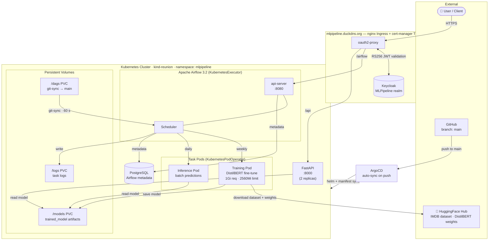

# MLPipeline: Kubernetes-Native ML Pipeline with Keycloak OAuth

A production-ready end-to-end NLP machine learning pipeline deployed on Kubernetes (`kind-reunion`) with Apache Airflow orchestration, FastAPI serving, and Keycloak OAuth authentication.

---

## CI/CD Status

**`main`** &nbsp;
[](https://github.com/rawhideron/MLPipeline/actions/workflows/ci.yml)
[](https://github.com/rawhideron/MLPipeline/actions/workflows/cd.yml)

**`dev`** &nbsp;
[](https://github.com/rawhideron/MLPipeline/actions/workflows/ci.yml)

## Tech Stack

### ML


### Serving & API


### Orchestration & Infrastructure


### Code Quality


---

## Architecture Overview



## Features

- **Apache Airflow on Kubernetes**: Distributed task execution using KubernetesPodOperator
- **Keycloak OAuth2**: Secure authentication for Airflow webserver and FastAPI
- **Text Classification Pipeline**: NLP example using HuggingFace Transformers
- **Helm Deployment**: Templated, repeatable infrastructure-as-code
- **Data Validation**: Great Expectations for data quality checks
- **Model Versioning**: DVC integration for reproducibility
- **TLS/HTTPS**: Secured domain (mlpipeline.duckdns.org)
- **Persistent Storage**: Kubernetes PVs for models, data, and logs

## Project Structure

```text
MLPipeline/
├── data/                       # Dataset storage
│   ├── raw/                   # Original data
│   ├── processed/             # Processed data
│   └── splits/                # Train/val/test splits
├── src/                        # Python source code
│   ├── preprocessing/         # Text cleaning, tokenization
│   ├── models/                # Model training & evaluation
│   ├── features/              # Feature engineering
│   ├── data_ingestion/        # Data loading utilities
│   └── utils/                 # Helper functions
├── dags/                       # Airflow DAGs
│   ├── training_dag.py        # Training pipeline orchestration
│   └── inference_dag.py       # Inference pipeline
├── serving/                    # FastAPI application
│   ├── app.py                 # Main FastAPI app
│   ├── oauth_middleware.py    # Keycloak OAuth integration
│   ├── Dockerfile             # Container image
│   └── requirements.txt        # Python dependencies
├── configs/                    # Configuration files
│   ├── training_config.yaml   # Model hyperparameters
│   ├── inference_config.yaml  # Inference settings
│   ├── data_validation.yml    # Great Expectations suite
│   └── keycloak-realm.json    # Keycloak realm definition
├── helm/                       # Helm charts
│   ├── values.yaml            # Umbrella chart values
│   ├── mlpipeline-airflow/    # Airflow Helm chart
│   ├── mlpipeline-serving/    # FastAPI Helm chart
│   └── mlpipeline-postgres/   # PostgreSQL Helm chart
├── kubernetes/                 # Raw K8s manifests
│   ├── namespace.yaml         # Namespace definition
│   ├── postgres-secret.yaml   # Database credentials
│   ├── configmap.yaml         # Configuration data
│   ├── ingress.yaml           # Ingress with TLS
│   ├── service-accounts.yaml  # RBAC configuration
│   └── network-policy.yaml    # Network policies
├── scripts/                    # Deployment automation
│   ├── deploy.sh              # Main deployment script
│   ├── setup-keycloak.sh      # Keycloak configuration
│   └── cleanup.sh             # Resource cleanup
├── tests/                      # Unit & integration tests
│   ├── test_preprocessing.py  # Preprocessing tests
│   ├── test_models.py         # Model tests
│   └── test_api.py            # API endpoint tests
├── notebooks/                  # Jupyter notebooks
│   └── exploration.ipynb      # Example walkthrough
├── requirements.txt            # Python dependencies
├── .gitignore                 # Git ignore rules
├── README.md                  # This file
├── DEPLOYMENT.md              # K8s deployment guide
└── KEYCLOAK_SETUP.md          # Keycloak configuration guide
```

## Prerequisites

- **Kubernetes Cluster**: `kind-reunion` (Kind cluster already configured)
- **kubectl**: Configured to access `kind-reunion`
- **Helm 3**: For chart-based deployment
- **Keycloak**: Instance with realm `MLPipeline` (to be configured)
- **cert-manager**: For TLS certificate management (duckdns.org)
- **duckdns.org account**: For dynamic DNS (mlpipeline.duckdns.org)
- **Docker**: For local image building (optional)

## Quick Start

### 1. Clone and Setup

```bash
cd /home/rongoodman/Projects
git clone https://github.com/rawhideron/MLPipeline.git
cd MLPipeline
```

### 2. Install Dependencies (Local Development)

```bash
python -m venv venv
source venv/bin/activate  # Linux/Mac
pip install -r requirements.txt
```

### 3. Deploy to Kubernetes

```bash
# Make deployment scripts executable
chmod +x scripts/*.sh

# Configure Keycloak realm and clients
./scripts/setup-keycloak.sh

# Deploy all services to kind-reunion
./scripts/deploy.sh
```

### 4. Access Services

- **Airflow Webserver**: [https://mlpipeline.duckdns.org/airflow](https://mlpipeline.duckdns.org/airflow) (OAuth login required)
- **FastAPI Docs**: [https://mlpipeline.duckdns.org/api/docs](https://mlpipeline.duckdns.org/api/docs) (OAuth login required)
- **Health Check**: [https://mlpipeline.duckdns.org/health](https://mlpipeline.duckdns.org/health) (public, no auth)

## ML Pipeline Workflow

### Training Pipeline (via Airflow DAG)

1. **Data Validation**: Checks raw data quality using Great Expectations
2. **Preprocessing**: Text cleaning, tokenization, and feature engineering
3. **Model Training**: Fine-tune DistilBERT on sentiment classification dataset
4. **Evaluation**: Compute metrics (accuracy, F1, precision, recall)
5. **Model Registry**: Version and save model artifacts
6. **Artifact Storage**: Push to persistent volume and DVC tracking

### Inference Pipeline

1. **Model Loading**: Retrieve versioned model from registry
2. **Batch Prediction**: Process input data in batches
3. **Result Storage**: Save predictions with confidence scores

### Serving API

- Real-time predictions via FastAPI `/predict` endpoint
- Token-based authentication via Keycloak
- Automatic API documentation at `/docs`

## Configuration

### Training Config (configs/training_config.yaml)

```yaml
model:
  name: distilbert-base-uncased
  hidden_size: 768
  num_labels: 2

training:
  epochs: 3
  batch_size: 2
  gradient_accumulation_steps: 4
  learning_rate: 2e-5
  warmup_steps: 500

data:
  validation_split: 0.2
  test_split: 0.1
  max_length: 128
```

### Keycloak Configuration

See [KEYCLOAK_SETUP.md](KEYCLOAK_SETUP.md) for:

- Creating `MLPipeline` realm
- Configuring OAuth clients for Airflow and FastAPI
- Setting up roles and scopes

## Deployment Guide

See [DEPLOYMENT.md](DEPLOYMENT.md) for detailed steps:

- Prerequisites verification
- Keycloak setup
- Helm chart deployment
- Verification and troubleshooting

## DAGs

DAG files live in the [`dags/`](dags/) directory. Merge a `.py` file there to `main` and git-sync delivers it to Airflow within ~60 seconds — no manual steps required.

| DAG                        | Schedule | Purpose                                                    |
| -------------------------- | -------- | ---------------------------------------------------------- |
| `mlpipeline_test_training` | Manual   | Fine-tunes DistilBERT on 200 IMDB samples — run this first |
| `mlpipeline_test_inference`| Manual   | Calls the live FastAPI endpoint with sample texts          |
| `mlpipeline_training`      | Weekly   | Full production training pipeline                          |
| `mlpipeline_inference`     | Daily    | Production batch inference                                 |

New DAGs are **paused by default** — toggle them on in the Airflow UI before triggering.

To validate a DAG locally before pushing:

```bash
airflow dags check --dag-id <dag_id>
```

CI automatically runs `airflow dags list-import-errors` on every PR — a DAG with a syntax error, wrong API call, or bad import will block the merge.

## Testing

```bash
# Run unit tests
pytest tests/ -v

# Run with coverage
pytest tests/ --cov=src --cov-report=html

# Run specific test file
pytest tests/test_models.py -v
```

## Development Workflow

### Local Testing (Without Kubernetes)

```bash
# Preprocess a sample
python src/preprocessing/text_cleaning.py

# Train model locally
python src/models/training.py configs/training_config.yaml

# Start FastAPI dev server
cd serving && uvicorn app:app --reload
```

### Kubernetes Debugging

```bash
# Port-forward to Airflow webserver
kubectl port-forward -n mlpipeline svc/airflow-webserver 8080:8080

# View Airflow scheduler logs
kubectl logs -n mlpipeline -f deployment/airflow-scheduler

# Execute into FastAPI pod
kubectl exec -it -n mlpipeline deployment/mlpipeline-serving -- /bin/bash

# Check persistent volumes
kubectl get pv -n mlpipeline
```

## Performance Characteristics

- **Training**: ~15 hours (DistilBERT, 3 epochs, CPU-only, 17.5k IMDB samples)
- **Inference**: ~50–100 ms per request (batch size 1) via FastAPI
- **Pipeline Throughput**: ~100 requests/sec (2 FastAPI replicas)

## Known Limitations

- Local LLM: Use [Ollama](https://ollama.com) with open-source models (Mistral, Llama 3, Phi-3) for advanced features
- Training: CPU-only (GPU support requires changing the torch wheel and pod requests)
- Storage: Limited to cluster storage (external S3 backend supported via DVC config)

## Contributing

1. Create a feature branch off `dev`: `feature/<name>` or `fix/<name>`
2. Make changes in `src/` or configuration files
3. Add tests in `tests/`
4. Run `pytest` and `ruff check` to verify
5. Open a PR targeting `dev` with `--auto` flag

## Troubleshooting

### Pods not starting

```bash
# Check pod events
kubectl describe pod -n mlpipeline <pod-name>

# View pod logs
kubectl logs -n mlpipeline <pod-name>

# Check resource requests
kubectl get nodes -o wide
kubectl top nodes
```

### OAuth login not working

- Verify Keycloak realm is created: `./scripts/setup-keycloak.sh`
- Check OAuth2-Proxy sidecar logs: `kubectl logs -n mlpipeline <pod-name> -c oauth2-proxy`
- Verify redirect URIs in Keycloak match `mlpipeline.duckdns.org`

### Model not found in serving

```bash
# Check persistent volume mounts
kubectl exec -n mlpipeline <serving-pod> -- ls /models/

# Verify training job completed
kubectl logs -n mlpipeline <training-task-pod>
```

## License

MIT License - See LICENSE file

## Support

For issues, questions, or contributions, please open an issue on GitHub or contact the maintainers.

---

**Last Updated**: April 2026  
**Status**: Actively Developed
